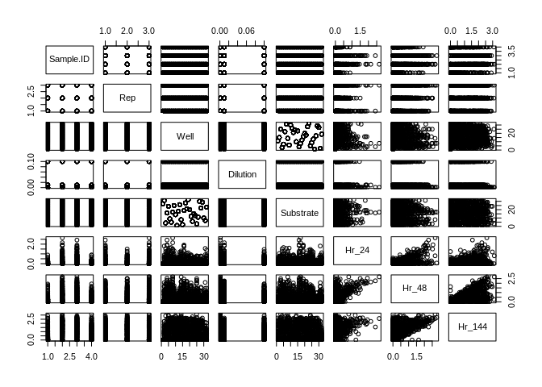
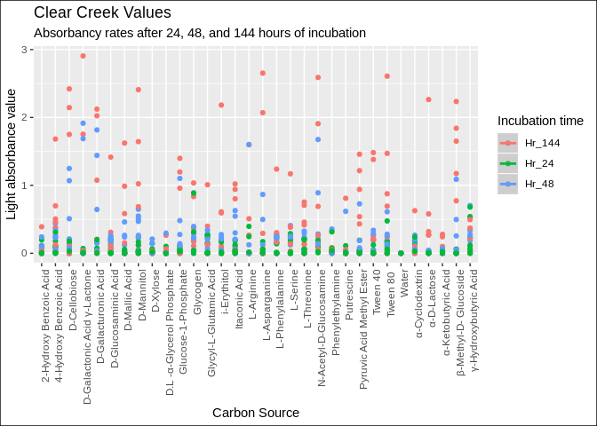
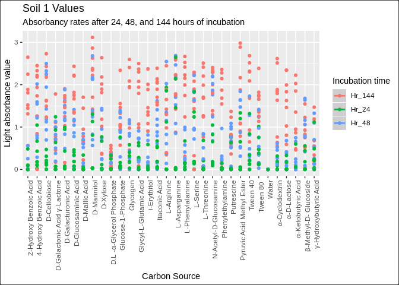
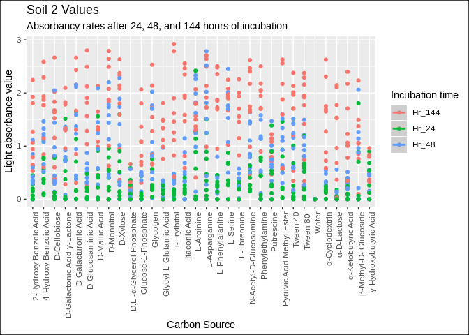
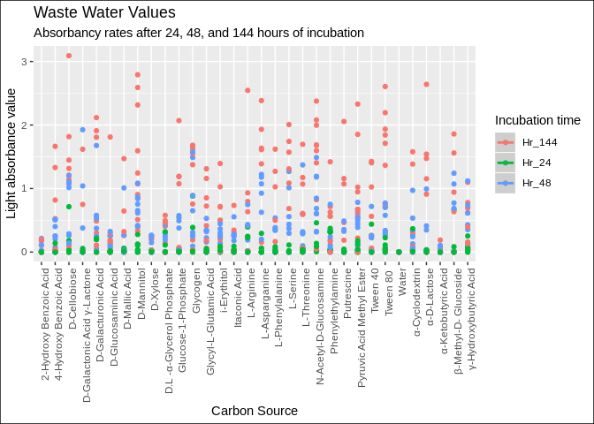
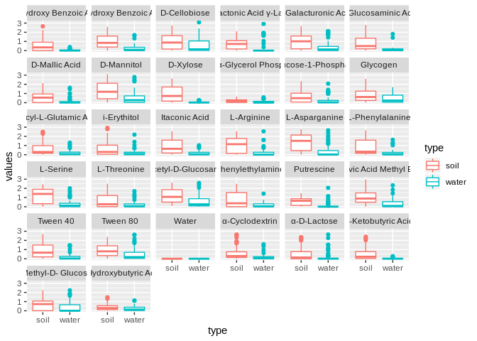
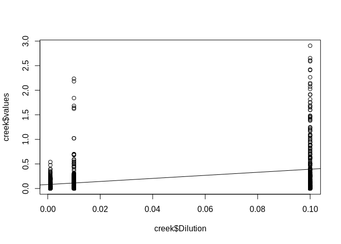
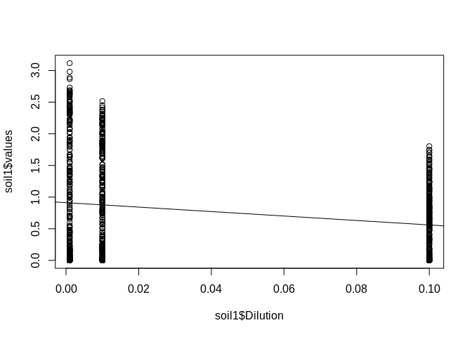
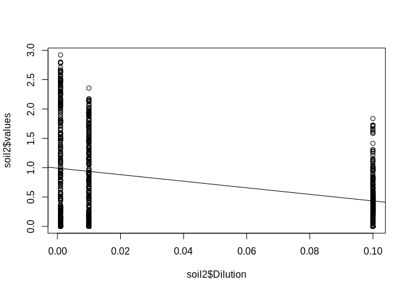
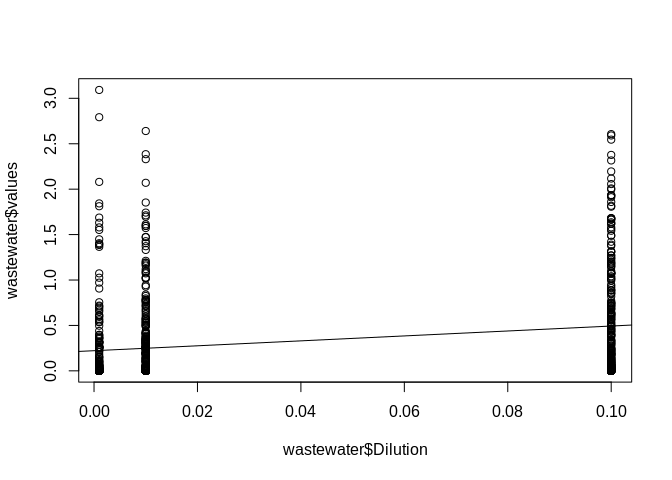

Exam 3
================

#### YAY for ecology\!

**First, what does our data look
    like?**

    ##     Sample.ID Rep Well Dilution                   Substrate Hr_24 Hr_48 Hr_144
    ## 1 Clear_Creek   1   A1    0.001                       Water 0.000 0.000  0.000
    ## 2 Clear_Creek   1   A2    0.001       β-Methyl-D- Glucoside 0.004 0.005  0.004
    ## 3 Clear_Creek   1   A3    0.001 D-Galactonic Acid γ-Lactone 0.008 0.007  0.001
    ## 4 Clear_Creek   1   A4    0.001                  L-Arginine 0.003 0.002  0.000
    ## 5 Clear_Creek   1   B1    0.001   Pyruvic Acid Methyl Ester 0.002 0.000  0.007
    ## 6 Clear_Creek   1   B2    0.001                    D-Xylose 0.011 0.008  0.021

Is it all in the ideal class
    type?

    ## Sample.ID       Rep      Well  Dilution Substrate     Hr_24     Hr_48    Hr_144 
    ##  "factor" "integer"  "factor" "numeric"  "factor" "numeric" "numeric" "numeric"

Hm. Looks alright to me.  
Let’s start to summarize and visualize the paired data.

    ##        Sample.ID        Rep         Well        Dilution    
    ##  Clear_Creek:288   Min.   :1   A1     : 36   Min.   :0.001  
    ##  Soil_1     :288   1st Qu.:1   A2     : 36   1st Qu.:0.001  
    ##  Soil_2     :288   Median :2   A3     : 36   Median :0.010  
    ##  Waste_Water:288   Mean   :2   A4     : 36   Mean   :0.037  
    ##                    3rd Qu.:3   B1     : 36   3rd Qu.:0.100  
    ##                    Max.   :3   B2     : 36   Max.   :0.100  
    ##                                (Other):936                  
    ##                        Substrate       Hr_24            Hr_48       
    ##  2-Hydroxy Benzoic Acid     : 36   Min.   :0.0000   Min.   :0.0000  
    ##  4-Hydroxy Benzoic Acid     : 36   1st Qu.:0.0000   1st Qu.:0.0060  
    ##  D-Cellobiose               : 36   Median :0.0320   Median :0.2595  
    ##  D-Galactonic Acid γ-Lactone: 36   Mean   :0.1703   Mean   :0.4691  
    ##  D-Galacturonic Acid        : 36   3rd Qu.:0.1872   3rd Qu.:0.7220  
    ##  D-Glucosaminic Acid        : 36   Max.   :2.6500   Max.   :2.7850  
    ##  (Other)                    :936                                    
    ##      Hr_144       
    ##  Min.   :0.00000  
    ##  1st Qu.:0.04175  
    ##  Median :0.75200  
    ##  Mean   :0.92497  
    ##  3rd Qu.:1.67950  
    ##  Max.   :3.11600  
    ## 

<!-- -->

### Question 1:

**Which sample locations are functionally different from each other in
terms of what C-substrates they can utilize?**  
The sample locations are:

    ## [1] "Clear_Creek" "Soil_1"      "Soil_2"      "Waste_Water"

And how many carbon sources are there?

    ## [1] 32

Let’s graph subsets of each location to help us visualize the how the
carbon sources are
used.

<!-- --><!-- --><!-- --><!-- -->

There is variance in the total amount of cabon being used and the
substrate that is used as a carbon source. It looks like the soil
samples are functionally different than the water sources because the
water samples have less diversity in carbon sources used and lower
values overall.

### Question 2:

**Are Soil and Water samples significantly different overall? What about
for individual carbon substrates?**

Let’s make a new column of data, “type”, that will allow us to see
whether a sample is water-sourced or soil-sourced. We’ll model with our
subsets to see if there’s a significant difference between the types,
and simutaneously gain information about substrate significance. Because
some of our variables are categorical and we later want to run a Tukey’s
test, we’ll start with a linear fit but ultimately want to use AOV for
these models.

``` r
moda <- aov(data = bound, values ~ Substrate * type)
summary(moda)
```

    ##                  Df Sum Sq Mean Sq F value   Pr(>F)    
    ## Substrate        31  143.0    4.61  12.484  < 2e-16 ***
    ## type              1  237.2  237.20 641.878  < 2e-16 ***
    ## Substrate:type   31   42.1    1.36   3.674 3.55e-11 ***
    ## Residuals      3392 1253.5    0.37                     
    ## ---
    ## Signif. codes:  0 '***' 0.001 '**' 0.01 '*' 0.05 '.' 0.1 ' ' 1

``` r
modb <- aov(data = bound, values ~ Substrate+type)
summary(modb)
```

    ##               Df Sum Sq Mean Sq F value Pr(>F)    
    ## Substrate     31  143.0    4.61   12.19 <2e-16 ***
    ## type           1  237.2  237.20  626.70 <2e-16 ***
    ## Residuals   3423 1295.6    0.38                   
    ## ---
    ## Signif. codes:  0 '***' 0.001 '**' 0.01 '*' 0.05 '.' 0.1 ' ' 1

According to these models, the sample type is a predictor of values, and
so is carbon source. Let’s try to visualize the difference of
utilization for each carbon source.
<!-- -->

### Question 3:

**If there are differences between samples, which C-substrates are
driving those differences?**  
The C-substrates that are driving the differences according to values ~
Substrate are any substrate with the higheset siggnificance codes from
the following list:

    ## 
    ## Call:
    ## lm(formula = values ~ Substrate * type, data = bound)
    ## 
    ## Residuals:
    ##     Min      1Q  Median      3Q     Max 
    ## -1.3675 -0.3568 -0.1332  0.1984  2.6406 
    ## 
    ## Coefficients:
    ##                                                 Estimate Std. Error t value
    ## (Intercept)                                     0.609204   0.082725   7.364
    ## Substrate4-Hydroxy Benzoic Acid                 0.412444   0.116991   3.525
    ## SubstrateD-Cellobiose                           0.409778   0.116991   3.503
    ## SubstrateD-Galactonic Acid γ-Lactone            0.116667   0.116991   0.997
    ## SubstrateD-Galacturonic Acid                    0.382444   0.116991   3.269
    ## SubstrateD-Glucosaminic Acid                    0.234093   0.116991   2.001
    ## SubstrateD-Mallic Acid                          0.009667   0.116991   0.083
    ## SubstrateD-Mannitol                             0.631981   0.116991   5.402
    ## SubstrateD-Xylose                               0.333370   0.116991   2.850
    ## SubstrateD.L -α-Glycerol Phosphate             -0.420556   0.116991  -3.595
    ## SubstrateGlucose-1-Phosphate                    0.015981   0.116991   0.137
    ## SubstrateGlycogen                               0.242000   0.116991   2.069
    ## SubstrateGlycyl-L-Glutamic Acid                 0.046333   0.116991   0.396
    ## Substratei-Erythitol                            0.022241   0.116991   0.190
    ## SubstrateItaconic Acid                          0.292037   0.116991   2.496
    ## SubstrateL-Arginine                             0.432741   0.116991   3.699
    ## SubstrateL-Asparganine                          0.758278   0.116991   6.482
    ## SubstrateL-Phenylalanine                        0.172370   0.116991   1.473
    ## SubstrateL-Serine                               0.581315   0.116991   4.969
    ## SubstrateL-Threonine                            0.061593   0.116991   0.526
    ## SubstrateN-Acetyl-D-Glucosamine                 0.595148   0.116991   5.087
    ## SubstratePhenylethylamine                       0.134333   0.116991   1.148
    ## SubstratePutrescine                            -0.017556   0.116991  -0.150
    ## SubstratePyruvic Acid Methyl Ester              0.391852   0.116991   3.349
    ## SubstrateTween 40                               0.296056   0.116991   2.531
    ## SubstrateTween 80                               0.332741   0.116991   2.844
    ## SubstrateWater                                 -0.609204   0.116991  -5.207
    ## Substrateα-Cyclodextrin                         0.042630   0.116991   0.364
    ## Substrateα-D-Lactose                           -0.074815   0.116991  -0.639
    ## Substrateα-Ketobutyric Acid                    -0.093981   0.116991  -0.803
    ## Substrateβ-Methyl-D- Glucoside                  0.056759   0.116991   0.485
    ## Substrateγ-Hydroxybutyric Acid                 -0.213148   0.116991  -1.822
    ## typewater                                      -0.561426   0.116991  -4.799
    ## Substrate4-Hydroxy Benzoic Acid:typewater      -0.210352   0.165450  -1.271
    ## SubstrateD-Cellobiose:typewater                 0.051815   0.165450   0.313
    ## SubstrateD-Galactonic Acid γ-Lactone:typewater  0.101000   0.165450   0.610
    ## SubstrateD-Galacturonic Acid:typewater         -0.017000   0.165450  -0.103
    ## SubstrateD-Glucosaminic Acid:typewater         -0.127370   0.165450  -0.770
    ## SubstrateD-Mallic Acid:typewater                0.107093   0.165450   0.647
    ## SubstrateD-Mannitol:typewater                  -0.134852   0.165450  -0.815
    ## SubstrateD-Xylose:typewater                    -0.332352   0.165450  -2.009
    ## SubstrateD.L -α-Glycerol Phosphate:typewater    0.469278   0.165450   2.836
    ## SubstrateGlucose-1-Phosphate:typewater          0.198574   0.165450   1.200
    ## SubstrateGlycogen:typewater                     0.163907   0.165450   0.991
    ## SubstrateGlycyl-L-Glutamic Acid:typewater       0.108796   0.165450   0.658
    ## Substratei-Erythitol:typewater                  0.160963   0.165450   0.973
    ## SubstrateItaconic Acid:typewater               -0.168259   0.165450  -1.017
    ## SubstrateL-Arginine:typewater                  -0.238370   0.165450  -1.441
    ## SubstrateL-Asparganine:typewater               -0.404093   0.165450  -2.442
    ## SubstrateL-Phenylalanine:typewater             -0.018630   0.165450  -0.113
    ## SubstrateL-Serine:typewater                    -0.310259   0.165450  -1.875
    ## SubstrateL-Threonine:typewater                  0.133130   0.165450   0.805
    ## SubstrateN-Acetyl-D-Glucosamine:typewater      -0.037500   0.165450  -0.227
    ## SubstratePhenylethylamine:typewater            -0.006741   0.165450  -0.041
    ## SubstratePutrescine:typewater                   0.118000   0.165450   0.713
    ## SubstratePyruvic Acid Methyl Ester:typewater   -0.089815   0.165450  -0.543
    ## SubstrateTween 40:typewater                    -0.120519   0.165450  -0.728
    ## SubstrateTween 80 :typewater                    0.112963   0.165450   0.683
    ## SubstrateWater:typewater                        0.561426   0.165450   3.393
    ## Substrateα-Cyclodextrin:typewater               0.093185   0.165450   0.563
    ## Substrateα-D-Lactose:typewater                  0.277833   0.165450   1.679
    ## Substrateα-Ketobutyric Acid:typewater           0.079000   0.165450   0.477
    ## Substrateβ-Methyl-D- Glucoside:typewater        0.252259   0.165450   1.525
    ## Substrateγ-Hydroxybutyric Acid:typewater        0.425648   0.165450   2.573
    ##                                                Pr(>|t|)    
    ## (Intercept)                                    2.23e-13 ***
    ## Substrate4-Hydroxy Benzoic Acid                0.000428 ***
    ## SubstrateD-Cellobiose                          0.000467 ***
    ## SubstrateD-Galactonic Acid γ-Lactone           0.318723    
    ## SubstrateD-Galacturonic Acid                   0.001090 ** 
    ## SubstrateD-Glucosaminic Acid                   0.045477 *  
    ## SubstrateD-Mallic Acid                         0.934152    
    ## SubstrateD-Mannitol                            7.04e-08 ***
    ## SubstrateD-Xylose                              0.004405 ** 
    ## SubstrateD.L -α-Glycerol Phosphate             0.000329 ***
    ## SubstrateGlucose-1-Phosphate                   0.891351    
    ## SubstrateGlycogen                              0.038665 *  
    ## SubstrateGlycyl-L-Glutamic Acid                0.692098    
    ## Substratei-Erythitol                           0.849237    
    ## SubstrateItaconic Acid                         0.012599 *  
    ## SubstrateL-Arginine                            0.000220 ***
    ## SubstrateL-Asparganine                         1.04e-10 ***
    ## SubstrateL-Phenylalanine                       0.140744    
    ## SubstrateL-Serine                              7.07e-07 ***
    ## SubstrateL-Threonine                           0.598593    
    ## SubstrateN-Acetyl-D-Glucosamine                3.83e-07 ***
    ## SubstratePhenylethylamine                      0.250950    
    ## SubstratePutrescine                            0.880727    
    ## SubstratePyruvic Acid Methyl Ester             0.000819 ***
    ## SubstrateTween 40                              0.011432 *  
    ## SubstrateTween 80                              0.004479 ** 
    ## SubstrateWater                                 2.03e-07 ***
    ## Substrateα-Cyclodextrin                        0.715593    
    ## Substrateα-D-Lactose                           0.522544    
    ## Substrateα-Ketobutyric Acid                    0.421843    
    ## Substrateβ-Methyl-D- Glucoside                 0.627593    
    ## Substrateγ-Hydroxybutyric Acid                 0.068554 .  
    ## typewater                                      1.66e-06 ***
    ## Substrate4-Hydroxy Benzoic Acid:typewater      0.203675    
    ## SubstrateD-Cellobiose:typewater                0.754166    
    ## SubstrateD-Galactonic Acid γ-Lactone:typewater 0.541600    
    ## SubstrateD-Galacturonic Acid:typewater         0.918167    
    ## SubstrateD-Glucosaminic Acid:typewater         0.441446    
    ## SubstrateD-Mallic Acid:typewater               0.517493    
    ## SubstrateD-Mannitol:typewater                  0.415093    
    ## SubstrateD-Xylose:typewater                    0.044640 *  
    ## SubstrateD.L -α-Glycerol Phosphate:typewater   0.004590 ** 
    ## SubstrateGlucose-1-Phosphate:typewater         0.230142    
    ## SubstrateGlycogen:typewater                    0.321913    
    ## SubstrateGlycyl-L-Glutamic Acid:typewater      0.510853    
    ## Substratei-Erythitol:typewater                 0.330681    
    ## SubstrateItaconic Acid:typewater               0.309235    
    ## SubstrateL-Arginine:typewater                  0.149750    
    ## SubstrateL-Asparganine:typewater               0.014641 *  
    ## SubstrateL-Phenylalanine:typewater             0.910354    
    ## SubstrateL-Serine:typewater                    0.060844 .  
    ## SubstrateL-Threonine:typewater                 0.421076    
    ## SubstrateN-Acetyl-D-Glucosamine:typewater      0.820706    
    ## SubstratePhenylethylamine:typewater            0.967504    
    ## SubstratePutrescine:typewater                  0.475766    
    ## SubstratePyruvic Acid Methyl Ester:typewater   0.587267    
    ## SubstrateTween 40:typewater                    0.466400    
    ## SubstrateTween 80 :typewater                   0.494803    
    ## SubstrateWater:typewater                       0.000698 ***
    ## Substrateα-Cyclodextrin:typewater              0.573320    
    ## Substrateα-D-Lactose:typewater                 0.093193 .  
    ## Substrateα-Ketobutyric Acid:typewater          0.633046    
    ## Substrateβ-Methyl-D- Glucoside:typewater       0.127430    
    ## Substrateγ-Hydroxybutyric Acid:typewater       0.010134 *  
    ## ---
    ## Signif. codes:  0 '***' 0.001 '**' 0.01 '*' 0.05 '.' 0.1 ' ' 1
    ## 
    ## Residual standard error: 0.6079 on 3392 degrees of freedom
    ## Multiple R-squared:  0.252,  Adjusted R-squared:  0.2381 
    ## F-statistic: 18.14 on 63 and 3392 DF,  p-value: < 2.2e-16

### Question 4:

**Does the dilution factor change any of these answers?**  
<!-- -->

    ##                 Df Sum Sq Mean Sq F value Pr(>F)    
    ## creek$Dilution   1  16.75  16.748   109.7 <2e-16 ***
    ## Residuals      862 131.64   0.153                   
    ## ---
    ## Signif. codes:  0 '***' 0.001 '**' 0.01 '*' 0.05 '.' 0.1 ' ' 1

<!-- -->

    ##                 Df Sum Sq Mean Sq F value   Pr(>F)    
    ## soil1$Dilution   1   21.4   21.41   35.13 4.46e-09 ***
    ## Residuals      862  525.4    0.61                     
    ## ---
    ## Signif. codes:  0 '***' 0.001 '**' 0.01 '*' 0.05 '.' 0.1 ' ' 1

<!-- -->

    ##                 Df Sum Sq Mean Sq F value Pr(>F)    
    ## soil2$Dilution   1   54.0   53.99   105.8 <2e-16 ***
    ## Residuals      862  439.8    0.51                   
    ## ---
    ## Signif. codes:  0 '***' 0.001 '**' 0.01 '*' 0.05 '.' 0.1 ' ' 1

<!-- -->

    ##                      Df Sum Sq Mean Sq F value   Pr(>F)    
    ## wastewater$Dilution   1  12.74  12.740   47.74 9.44e-12 ***
    ## Residuals           862 230.01   0.267                     
    ## ---
    ## Signif. codes:  0 '***' 0.001 '**' 0.01 '*' 0.05 '.' 0.1 ' ' 1

Less carbon is being consumed as the concentration of the soil samples
increases.  
More carbon is being consumed as the concentration of the water samples
increases.

### Question 5:

**Do the control samples indicate any contamination?**  
Water is the negative control. If the BioLog machine reads a light
absorbtion value other than 0 for the negative control, there is
contamination.

    ##      Sample.ID Rep Well Dilution Substrate Hr_24 Hr_48 Hr_144
    ## 1  Clear_Creek   1   A1    0.001     Water     0     0      0
    ## 2  Clear_Creek   1   A1    0.010     Water     0     0      0
    ## 3  Clear_Creek   1   A1    0.100     Water     0     0      0
    ## 4  Clear_Creek   2   A1    0.001     Water     0     0      0
    ## 5  Clear_Creek   2   A1    0.010     Water     0     0      0
    ## 6  Clear_Creek   2   A1    0.100     Water     0     0      0
    ## 7  Clear_Creek   3   A1    0.001     Water     0     0      0
    ## 8  Clear_Creek   3   A1    0.010     Water     0     0      0
    ## 9  Clear_Creek   3   A1    0.100     Water     0     0      0
    ## 10      Soil_1   1   A1    0.001     Water     0     0      0
    ## 11      Soil_1   1   A1    0.010     Water     0     0      0
    ## 12      Soil_1   1   A1    0.100     Water     0     0      0
    ## 13      Soil_1   2   A1    0.001     Water     0     0      0
    ## 14      Soil_1   2   A1    0.010     Water     0     0      0
    ## 15      Soil_1   2   A1    0.100     Water     0     0      0
    ## 16      Soil_1   3   A1    0.001     Water     0     0      0
    ## 17      Soil_1   3   A1    0.010     Water     0     0      0
    ## 18      Soil_1   3   A1    0.100     Water     0     0      0
    ## 19      Soil_2   1   A1    0.001     Water     0     0      0
    ## 20      Soil_2   1   A1    0.010     Water     0     0      0
    ## 21      Soil_2   1   A1    0.100     Water     0     0      0
    ## 22      Soil_2   2   A1    0.001     Water     0     0      0
    ## 23      Soil_2   2   A1    0.010     Water     0     0      0
    ## 24      Soil_2   2   A1    0.100     Water     0     0      0
    ## 25      Soil_2   3   A1    0.001     Water     0     0      0
    ## 26      Soil_2   3   A1    0.010     Water     0     0      0
    ## 27      Soil_2   3   A1    0.100     Water     0     0      0
    ## 28 Waste_Water   1   A1    0.001     Water     0     0      0
    ## 29 Waste_Water   1   A1    0.010     Water     0     0      0
    ## 30 Waste_Water   1   A1    0.100     Water     0     0      0
    ## 31 Waste_Water   2   A1    0.001     Water     0     0      0
    ## 32 Waste_Water   2   A1    0.010     Water     0     0      0
    ## 33 Waste_Water   2   A1    0.100     Water     0     0      0
    ## 34 Waste_Water   3   A1    0.001     Water     0     0      0
    ## 35 Waste_Water   3   A1    0.010     Water     0     0      0
    ## 36 Waste_Water   3   A1    0.100     Water     0     0      0

Looking at the values under Hr\_24, Hr\_48, and Hr\_144, we can see that
all of the values are 0, telling us that there was no contamination
measured at any point during incubation.
